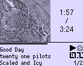
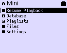
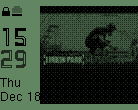

# Minimlesser - iPod Mini 2G theme

<table align="center">
    <tr>
        <td>
            <figcaption>WPS</figcaption>
        </td>
        <td>
            
            <figcaption>Main Menu</figcaption>
        </td>
        <td>
            
            <figcaption>WPS with cover placeholder</figcaption>
        </td>
    </tr>
    <tr>
        <td>
            
            <figcaption>Lock Screen with music playing</figcaption>
        </td>
        <td>
        
        <figcaption>Lock Screen</figcaption>
        </td>
        <td>
            
            <figcaption>Lock Screen with cover placeholder</figcaption>
        </td>
    </tr>
    <tr>
        <td colspan="3">
            
            <figcaption>USB Mode</figcaption>
        </td>
    </tr>
</table>

This is an iPod Mini theme based on the fantastic [Minimless](https://github.com/Olsro/rockbox-mini2g-themes) theme by OlsroFR.
I did small changes on the WPS and SBS to fit my personal taste.

## How to install

1. Install extra "Fonts file" from the latest [daily build](https://www.rockbox.org/daily.shtml)
2. Then copy the contents of `rockbox` folder into your player `/.rockbox` folder, eventually replacing older files/folders
3. Head to the theme settings of your player and select the `minimlesser.cfg` theme.
